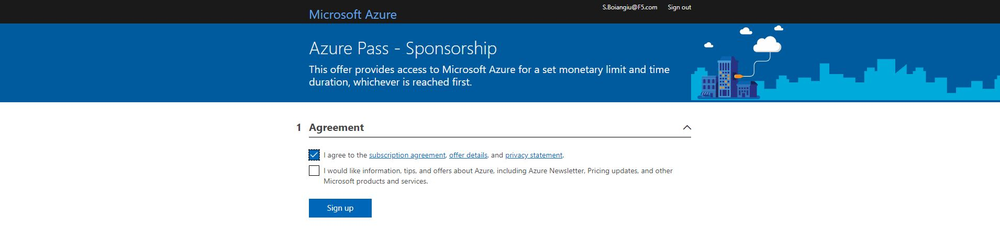
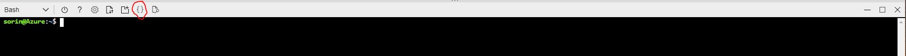
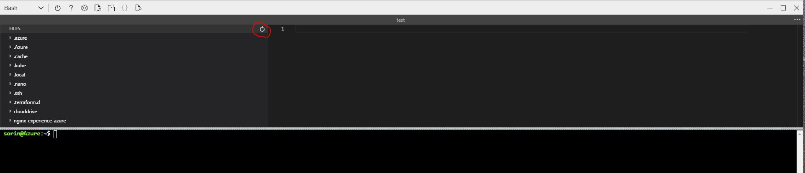

## Intro to the workshop

This workshop will provide guidelines on how to deploy an application from scratch in Amazon Elastic Kubernetes Service environment while protecting and enhancing the application availability and usability with Nginx solutions.

For this workshop we are going to use the "Arcadia Financial" application.
The application is built with 4 different microservices that are deployed in the Kubernetes environment.
- Main - provides access to the web GUI of the application for use by browsers
- Backend - is a supporting microservice and provides support for the customer facing services only
- App2 - provides money transfer API based functionalities for both the Web app and third party consumer applications
- App3 - provides referral API based functionalities for both the Web app and third party consumer applications


By the end of the workshop the "Arcadia Financial" will be fully deployed and protected as described in the bellow diagram.


## Azure console and general instructions

During the workshop we will use the Azure "Cloud Shell" console. All the tools required to run the lab are included.  
Azure Cloud Shell is an interactive, authenticated, browser-accessible shell for managing Azure resources. It provides the flexibility of choosing the shell experience that best suits the way you work, either Bash or PowerShell. 
Cloud Shell enables access to a browser-based command-line experience built with Azure management tasks in mind. Leverage Cloud Shell to work untethered from a local machine in a way only the cloud can provide.  

1. Browse to https://www.microsoftazurepass.com/ and click "Start" and login with your Microsoft account

2. Enter the provided promo code and wait for the page to be redirected to the signup page


3. Click the first and second options checkboxes and wait for the signup process toi finish.


4. Open the "Cloud Shell" console.


5. Click "Open editor" in order to see all the files in the system and interact with them



6. When required to create a new file use the following command in the shell, after creating the file refresh the editor view in order to see it and edit it.
> touch path/filename




7. Clone the Workshop Repo:
```
git clone https://github.com/sorinboia/nginx-experience-azure
cd nginx-experience-azure/
```

&nbsp;&nbsp;

#### [Next, let's deploy the infrastructure using Terraform](3tf.md)
